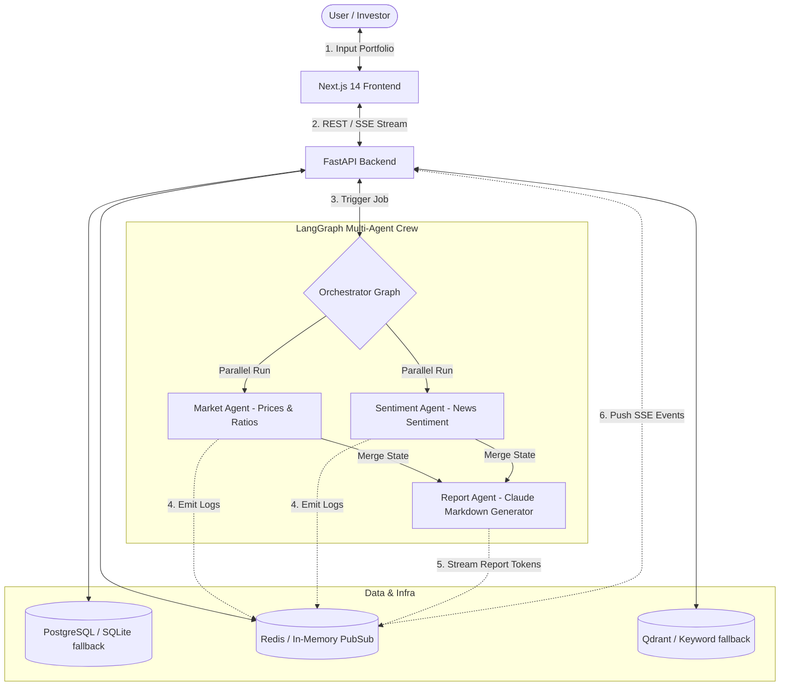

# Antigravity Financial Analyst - AI Agent Crew

An autonomous, production-grade **Agentic AI Ops Manager** and financial portfolio analysis engine. This system coordinates a crew of dedicated agents powered by **LangGraph** that cooperate under a strict, explainable **Think &rarr; Decide &rarr; Act &rarr; Observe &rarr; Repeat** loop. 

The system tracks stock pricing multiples, audits qualitative public news media, stress-tests allocations across major historical crash regimes, streams markdown summaries via **Redis Pub/Sub &amp; Server-Sent Events (SSE)**, and displays results inside a premium, glassmorphic dark-mode web terminal.

---

## 📈 System Architecture



---

## 🔥 Features & Capabilities

1. **Deterministic Parallel Agents**:
   - **Market Agent**: Scans real-time prices, sector details, beta volatility metrics, and historical quotes from Yahoo Finance.
   - **Sentiment Agent**: Gathers public narratives and headlines, computing VADER polarity scores (-1.0 to +1.0) to categorize asset bias.
   - **Report Agent**: Merges analysis and leverages Claude to stream detailed investment summaries token-by-token.
2. **Explainable Terminal Logs**: Every agent records its **Think-Decide-Act** states in real-time, streaming logs live to the dashboard console.
3. **Resilient Local Fallbacks**: Auto-detects offline states. If Docker services or external APIs are missing, it falls back to SQLite DBs, in-memory pub-sub channels, synthetic mock tickers, and pre-seeded glossary vector lists.
4. **Stress Simulator & sliders**: Run what-if allocation sliders to recalculate portfolio drawdowns under the 2008 Financial Crisis, COVID-2020 Crash, and Dot-com Meltdown.
5. **D3 Circular Risk Gauge & Treemaps**: Visual indicators detailing custom weighted betas and sector exposures.
6. **Executive PDF Export**: Connects a download button to a backend ReportLab parser compiling sleek corporate PDF brochures.

---

## 🚀 Setup & Execution

### 1. Prerequisite Environment

Copy the environment parameters template:
```bash
cp .env.example .env
```
Ensure your `.env` contains your `ANTHROPIC_API_KEY` for Claude reports, or leave it as `mock_key` to activate the high-fidelity mock fallback reporter.

### 2. Infrastructure Setup (Optional)

If Docker is installed, spin up Postgres, Redis, and Qdrant:
```bash
docker-compose -f infra/docker-compose.yml up -d
```
*If Docker is not running, the application will automatically fall back to localized SQLite databases, in-memory pub-sub, and mock indices.*

### 3. Running the Backend Server

Install dependencies:
```bash
python3.12 -m pip install -r backend/requirements.txt
```
Launch the FastAPI development engine:
```bash
python3.12 -m backend.main
```
The server will boot on `http://localhost:8000`.

### 4. Running the Frontend Dashboard

Install Node modules:
```bash
cd frontend
npm install
```
Launch the Next.js dev server:
```bash
npm run dev
```
Open `http://localhost:3000` in your web browser.

---

## 🛡️ Robust Failover Controls

- **No PostgreSQL?** Reverts to `aiosqlite` at `./financial_analysis_db`.
- **No Redis?** Subscribes to local in-memory `asyncio.Queue` listener arrays.
- **No Qdrant?** Leverages internal similarity text keyword parsers.
- **No Claude API Key?** Generates premium dynamic report templates based on active metrics.
