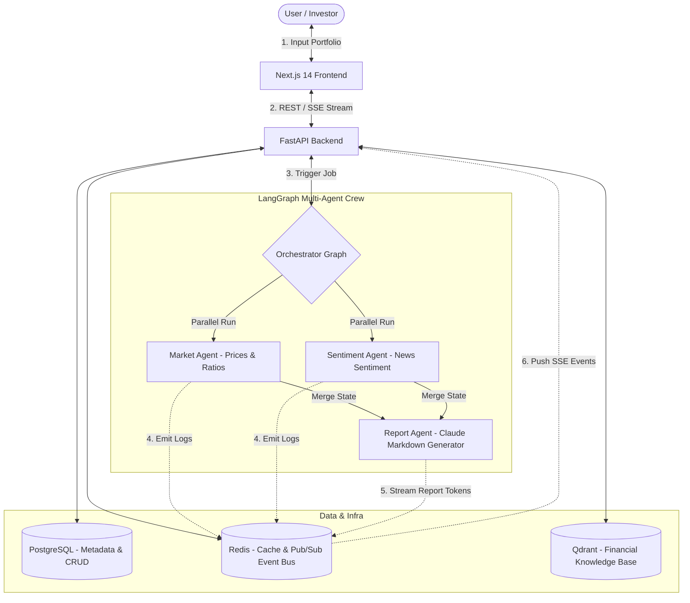

# Implementation Plan: Multi-Agent Financial Analysis Platform

This implementation plan details a production-grade, deterministic, and highly explainable **Agentic AI Ops Manager** for financial portfolio analysis. 

The system leverages a team of agents that operate under an explicit **Think → Decide → Act → Observe → Repeat** loop. The agents collaborate via **LangGraph**, exchange messages through shared memory, stream status updates and tokens in real-time via **Redis pub/sub + Server-Sent Events (SSE)**, and present an interactive, premium dashboard using **Next.js 14, TailwindCSS, Recharts, and D3**.

---

## System Architecture

The following diagram illustrates the workflow and data flow between the User, Next.js Frontend, FastAPI Backend, Redis Event Bus, and the LangGraph Multi-Agent Crew:



---

## Agentic Reasoning Design (Think → Decide → Act → Observe → Repeat)

Each agent in the crew will implement a standard execution block that logs its exact reasoning cycle. This ensures absolute explainability and visible logs.

### Cycle Example
1. **THINK**: *Analyze current state & sub-goals.* "I have been assigned to evaluate Apple (AAPL). I need to check its valuation (P/E) and price history to compute its risk profile."
2. **DECIDE**: *Select the best tool or action.* "I will invoke `yfinance_tool` with arguments `ticker='AAPL', period='1y'`."
3. **ACT**: *Execute the action.* "Calling `yfinance_tool` for AAPL..."
4. **OBSERVE**: *Capture tool execution outputs.* "AAPL price is $180.25, P/E ratio is 28.4, Beta is 1.28. 1-year historical return data loaded."
5. **REPEAT**: *Refine sub-goal or conclude.* "All metrics for AAPL successfully retrieved. Transitioning to next ticker: MSFT..."

These logs will be emitted in real-time to Redis and streamed to the frontend so that the user sees exactly what the agents are thinking, deciding, and acting upon.

---

## Proposed Changes & File Layout

We will build the system in a highly structured, modular layout:

```
financial-analyst/
├── frontend/                  # Next.js 14 app
│   ├── app/
│   │   ├── layout.tsx         # Root layout & Providers
│   │   ├── page.tsx           # Portfolio landing input
│   │   ├── dashboard/
│   │   │   └── [job_id]/
│   │   │       └── page.tsx   # Live stream & premium charts
│   │   └── api/
│   │       └── stream/
│   │           └── route.ts   # SSE Proxy to backend
│   ├── components/
│   │   ├── PortfolioInput.tsx   # Custom ticker table with weight validation
│   │   ├── AgentStatusBar.tsx   # Live agent terminal showing Think-Decide-Act
│   │   ├── StreamingReport.tsx  # Markdown renderer with smooth token streaming
│   │   ├── PortfolioChart.tsx   # Recharts AreaChart comparing portfolio vs S&P500
│   │   ├── SectorHeatmap.tsx    # Recharts Treemap by sector weight
│   │   ├── RiskGauge.tsx        # Premium D3.js svg-based arc risk gauge
│   │   ├── StressTestPanel.tsx  # Tabs + what-if sliders for historical crashes
│   │   └── PDFExportButton.tsx  # PDF downloader trigger
│   ├── tailwind.config.ts
│   └── next.config.ts
├── backend/                   # FastAPI + LangGraph
│   ├── main.py                # CORS, API routers, and SSE streams
│   ├── agents/
│   │   ├── orchestrator.py    # LangGraph definition
│   │   ├── market_agent.py    # Price, PE, beta gatherer
│   │   ├── sentiment_agent.py # News + VADER gatherer
│   │   └── report_agent.py    # Anthropic Claude report generator
│   ├── tools/
│   │   ├── yfinance_tool.py   # Yahoo Finance wrapper with local caching
│   │   ├── news_tool.py       # News fetcher + VADER analyzer
│   │   ├── qdrant_tool.py     # Document vector search helper (RAG)
│   │   └── stress_test.py     # Scenario stress test simulation engine
│   ├── services/
│   │   ├── pdf_service.py     # ReportLab PDF generator (Premium templates)
│   │   ├── sse_service.py     # Redis Pub/Sub events manager
│   │   └── portfolio_service.py
│   ├── models/
│   │   ├── portfolio.py       # DB schemas & validation
│   │   └── report.py          # Job status and report schemas
│   ├── db/
│   │   └── database.py        # SQLAlchemy Async engine
│   └── requirements.txt
├── infra/
│   ├── docker-compose.yml     # Postgres, Redis, Qdrant
│   └── .env.example           # Shared environment variables
└── README.md
```

---

## Detailed Phases

### Phase 1: Project Setup & Data Layer (Days 1–2)
1. **Initialize Backend**:
   - Establish `requirements.txt` with core modules.
   - Configure `backend/db/database.py` with an async SQLAlchemy engine. Provide a seamless SQLite fallback if Postgres is unavailable, making the project highly robust.
   - Design Database schemas for `Portfolio`, `Ticker`, and `AnalysisJob`.
2. **Develop `yfinance_tool.py`**:
   - Fetch real-time price, sector, P/E ratio, beta, and 1-year historical prices.
   - Implement caching (Redis + SQLite fallback) to prevent rate-limiting.
3. **Infrastructure**:
   - Provide `infra/docker-compose.yml` for Postgres, Redis, and Qdrant.
   - Create `.env.example` with configurations.

### Phase 2: Agent Crew & LangGraph Orchestration (Days 3–5)
1. **Define Agents**:
   - **Market Agent (`market_agent.py`)**: Fetches price ratios, beta, and 1y returns. Uses explicit Think-Decide-Act loops.
   - **Sentiment Agent (`sentiment_agent.py`)**: Gathers market headlines and analyzes sentiment with VADER.
   - **Report Agent (`report_agent.py`)**: Uses the Anthropic SDK to stream high-fidelity portfolio markdown reports.
2. **LangGraph Orchestrator (`orchestrator.py`)**:
   - Construct a state graph where Market and Sentiment agents run in parallel.
   - Combine their insights into the final Report Agent.
   - Emit live execution events through the Redis Pub/Sub channel.

### Phase 3: SSE Streaming API (Days 6–7)
1. **Build `sse_service.py`**:
   - Manage connection hubs, publishing, and subscribing to Redis events.
2. **Expose Endpoints in FastAPI**:
   - `POST /api/portfolio`: Submit ticker symbols and weight allocations.
   - `GET /api/stream/{job_id}`: Stream structured Server-Sent Events (SSE) including status changes, agent logs, and markdown chunks.
   - Implement robust error handling and mock generation if external API tokens are missing.

### Phase 4: Frontend Premium Dashboard (Days 8–11)
1. **Setup Next.js 14 App**:
   - Tailwind CSS integration, dark mode styling, and custom font options.
2. **UI Components**:
   - **`PortfolioInput.tsx`**: Add/remove tickers dynamically, validated to ensure total weights equal exactly 100%.
   - **`AgentStatusBar.tsx`**: Live feed showing the Think-Decide-Act terminal for each running agent.
   - **`StreamingReport.tsx`**: Render markdown reports on the fly as tokens stream in.
   - **`PortfolioChart.tsx`**: Display performance comparisons between the user's portfolio and the S&P 500.
   - **`SectorHeatmap.tsx`**: Display sector allocations visually using a Recharts Treemap.
   - **`RiskGauge.tsx`**: A gorgeous SVG D3 gauge showing the calculated portfolio risk rating (1–10).

### Phase 5: PDF Export & Stress Testing (Days 12–14)
1. **Historical Stress Tester (`stress_test.py`)**:
   - Replay market crashes: 2008 Financial Crisis, COVID-2020, and the Dot-com Crash.
   - Calculate projected drawdowns and maximum recovery times.
2. **`StressTestPanel.tsx`**:
   - Interactive sliders allowing users to run what-if weight scenarios.
3. **`pdf_service.py`**:
   - Use ReportLab to compile analytical PDFs complete with styling, cover sheet, and key metrics tables.

### Phase 6: Polish & Deployment (Days 15–16)
1. Configure tailwind dark mode, tune Redis TTL, and write an extensive README with comprehensive usage instructions.

---

## Verification Plan

### 1. Backend Verification
- Use Pytest or manual scripts to run:
  - `yfinance_tool.py` against key symbols (AAPL, MSFT, TSLA, AMZN, GOOGL) and assert correct data formatting.
  - LangGraph orchestrator execution and verify graph completion.
  - Redis connection checks and pub/sub validation.
- Command:
  ```powershell
  python -m backend.tools.yfinance_tool
  ```

### 2. Frontend Verification
- Spin up the dev server (`npm run dev`) and test layout responsiveness.
- Verify weight validations and EventSource event consumption.
- Verify D3 Gauge and Recharts rendering under different stock portfolios.

---

## User Review Required

> [!IMPORTANT]
> - **Fallback Mechanics**: If Docker/Postgres/Redis/Qdrant are not running locally, the backend will auto-fallback to SQLite, SQLite-based Vector DB, and In-Memory event queuing to guarantee instant usability.
> - **API Keys**: We will require `ANTHROPIC_API_KEY` for Claude reports, and will support generic fallback report generation if the API key is not present.
